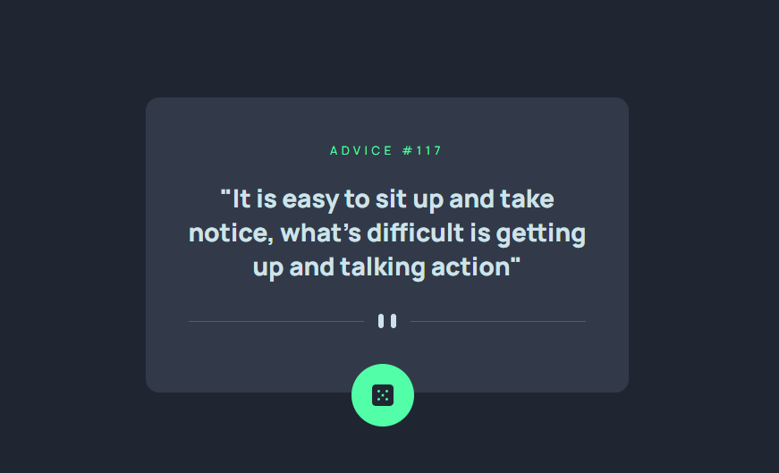

# Citações com Flexbox 


Esta é uma solução para o exercício proposto na aula de CSS Avançado - Flexbox. Os desafios do Frontend Mentor ajudam você a melhorar suas habilidades de codificação através da construção de projetos realistas. 

## Índice

- [Overview](#overview)
  - [O desafio](#o-desafio)
  - [Print do projeto](#print-do-projeto)
  - [Link](#link)
- [Meu processo](#meu-processo)
  - [Construído com](#construido-com)
  - [O que aprendi](#o-que-aprendi)
  - [Desenvolvimento contínuo](#desenvolviment-continuo)
- [Autora](#autora)
- [Agradecimentos](#agradecimentos)

## Overview

### O desafio

O desafio constiste em:

- testar nossos conhecimentos com front-end, mas expecificadamente o CSS, na parte de flexbox;
- mostrar nossa capacidade em utilizar as propriedades relacionadas ao flex e seus atributos;

### Print do projeto

 

### Link

- Código do desenvolvimento: [NFT Card](https://github.com/maiarasteffen/advice)
- Front do projeto: [Front]()

## Meu processo

### Construído com

- Semântica HTML;
- Propriedades CSS;
- Flexbox;
- Positions;
- Variáveis no CSS;

### O que aprendi

Aprendi como utilizar e centralizar os elementos como flexbox, propriedades mais usadas foram: display, justify-content e align-itens.

Código utilizado:

```html
<body>
  <main class="container">
    <div class="card">
      <p class="advice">ADVICE #117</p>
      <P class="quote">"It is easy to sit up and take notice, what's difficult is getting up and talking action"</P>
      
      <button class="icon">
        
      </button>
    </div>
  </main>
</body>
```
```css
body {
    background-color: var(--background-color);
    font-family: 'Manrope', sans-serif;
    color: var(--text-color);
    height: 100vh;
}

.container {
    display: flex;
    justify-content: center;
    align-items: center;
    height: 100%;
    padding: 25px;
}

.card {
    width: 540px;
    height: 330px;
    background-color: var(--card-color);
    border-radius: 15px;
    text-align: center;
}

.advice {
    font-size: 13px;
    color: var(--button-color);
    letter-spacing: .3rem;
    margin-top: 50px;
}

.quote { 
    display: flex;
    justify-content: center;
    align-items: center;
    font-size: 28px;
    font-weight: 800; 
    margin: 25px 40px;
}

.divider {
    margin-top: 10px;
}

.icon {
    background-color: var(--button-color);
    border-radius: 50%;
    border: none;
    display: flex;
    align-items: center;
    justify-content: center;
    width: 70px;
    height: 70px;
    margin-left: 230px;
    transform: translateY(50%);
    cursor: pointer;
}

.icon:hover {
    color: #53FFAB;
    box-shadow: 0 5px 15px hsl(150, 100%, 66%);
}
```

### Desenvolvimento contínuo

Irei continuar me aperfeiçoando na parte de CSS, focando no Flexbox e Grid. Além de estilizar elementos com pseudo-elementos. Também daqui em diante irei me aperfeiçoar na área de React Native e Rest API com Node.js! Por isso estou treinando bem a base do Front-end!

## Author

- Linkedin - [Maiara Steffen](https://www.linkedin.com/in/maiara-steffen/)
- Frontend Mentor - [@maiarasteffen](https://www.frontendmentor.io/profile/maiarasteffen)
- Instagram - [@maiara_steffen](https://www.instagram.com/maiara_steffen/)
- GitHub - [@maiarasteffen](https://github.com/maiarasteffen/)

## Agradecimentos

Primeiro quero agradecer muito a Deus por sempre estar me dando oportunidades de me desenvolver cada vez mais na carreira de programadora, também quero agradecer muito ao [Dev Em Dobro](https://www.instagram.com/devemdobro/), os irmãos que me ensinam muitas pessoas a se desenvolverem e crescerem no mercado de trabalho como programador!